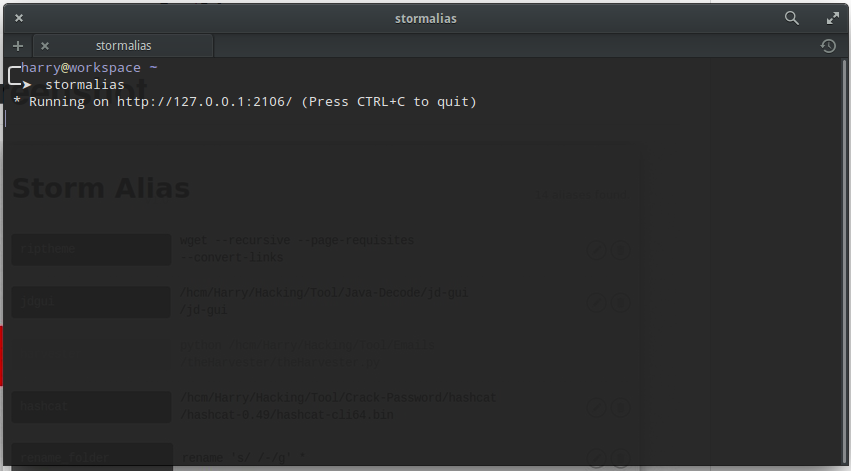
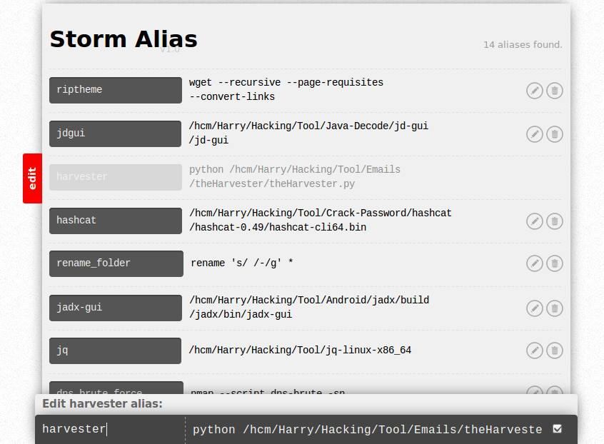

Thanks @emre (https://github.com/emre/storm)  
# Install
`sudo python setup.py install`
# Configuartion
Append the code into `~/.zshrc` or `~/.bashrc` 
```bash
if [ -f ~/.aliases ]; then
        . ~/.aliases
fi
```
# Commands
```bash
Usage: stormalias [options]

Options:
  -h, --help            show this help message and exit
  -p PORT, --port=PORT  2106
  -d DEBUG, --debug=DEBUG
                        True|False
```

# Screenshot
   
   
